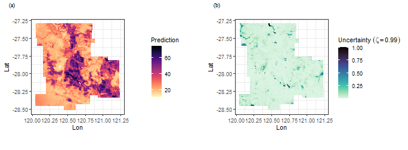

&nbsp;


### Citation for package `geosimilarity`

To cite **`geosimilarity` R package** in publications, please use:

**Song, Y. (2022) "Geographically Optimal Similarity", Mathematical Geosciences. doi: [10.1007/s11004-022-10036-8][7].**


&nbsp;


&nbsp;

## 1. Introduction to `geosimilarity` package

*The package can be used to address following issues:*

- Geographically optimal similarity (GOS) modeling.

- Modeling the Third Law of Geography (i.e., basic configuration similarity (BCS) model).

- Spatial prediction.

More details of GOS models can be found in [Song (2022)][7].

&nbsp;


## 2. Spatial prediction using GOS model

According to [Song (2022)][7], GOS model consists of four primary steps: (1) Characterizing geographical configurations, (2) determining parameters for the optimal similarity, (3) spatial prediction using GOS and uncertainty assessment, and (4) model evaluation. The process of using `geosimilarity` package to conduct GOS modeling is presented as follows.

### 2.1 Characterizing geographical configurations

The `geosimilarity` package contains two spatial datasets:

- `zn`: Spatial samples of Zn concentrations and explanatory variables at sample locations

- `grid`: Spatial grid data of explanatory variables used for the prediction


``` r
install.packages("geosimilarity", dependencies = TRUE)
```


``` r
library(geosimilarity)
data("zn")
head(zn)
## # A tibble: 6 × 12
##     Lon   Lat    Zn Elevation Slope Aspect  Water  NDVI   SOC    pH    Road  Mine
##   <dbl> <dbl> <dbl>     <dbl> <dbl>  <dbl>  <dbl> <dbl> <dbl> <dbl>   <dbl> <dbl>
## 1  120. -28.5    10      455. 0.236  306.  0.014  0.184 0.909  5.95 49.4     55.6
## 2  120. -28.4    30      451. 0.207  293.  2.20   0.202 0.906  6.05 49.0     51.1
## 3  120. -28.4    30      443. 0.285  325.  0.0119 0.163 0.848  5.76 45.1     45.0
## 4  120. -27.4    30      509. 0.236   98.4 3.06   0.204 0.851  5.82  0.0774  49.0
## 5  120. -28.3    33      427. 0.191  329.  3.53   0.179 0.933  5.85 39.9     39.8
## 6  120. -27.3    27      510. 0.211  105.  3.38   0.191 0.868  6.07  0.0468  48.7
```

Data pre-processing and variable selection:


``` r
# log-transformation
hist(zn$Zn)
```


``` r
zn$Zn <- log(zn$Zn)
hist(zn$Zn)
```


``` r

# remove outliers
library(SecDim)
## This is `SecDim` package.
##                         
## To cite `SecDim` in publications, please use:
##                         
## Song, Y. (2022). The second dimension of spatial association. International Journal of Applied Earth Observation and Geoinformation. 2022. 111, 102834. doi: 10.1016/j.jag.2022.102834.
## 
k <- rmvoutlier(zn$Zn, coef = 2.5)
## Remove 9 outlier(s)
dt <- zn[-k,]

# correlation
library("PerformanceAnalytics")
## Loading required package: xts
## Loading required package: zoo
## 
## Attaching package: 'zoo'
## The following objects are masked from 'package:base':
## 
##     as.Date, as.Date.numeric
## 
## Attaching package: 'PerformanceAnalytics'
## The following object is masked from 'package:graphics':
## 
##     legend
cor_dt <- dt[, c(3:12)]
chart.Correlation(cor_dt, histogram = TRUE, pch = 19)
```


``` r

# multicollinearity
library(car)
## Loading required package: carData
## 
## Attaching package: 'car'
## The following object is masked from 'package:SecDim':
## 
##     vif
m1 <- lm(Zn ~ Slope + Water + NDVI + SOC + pH + Road + Mine, data = dt)
car::vif(m1)
##    Slope    Water     NDVI      SOC       pH     Road     Mine 
## 1.651039 1.232454 1.459539 1.355824 1.568347 2.273387 2.608347
```

In this step, the selected variables include Slope, Water, NDVI, SOC, pH, Road, and Mine.

### 2.2 Determining the optimal similarity

In the `gos_bestkappa()` function, if you set more optional numbers to the `kappa` vector and a higher value of the cross-validation repeat times `nrepeat`, a $\kappa$ value enabling more accurate prediction will be selected, but the computation time will be increased. You can specify the `cores` parameter to use multiple CPU cores for parallel computing.

*The default ratio of train set to test set in `gos_bestkappa()` is `1:1`(`0.5`). You can specify the ratio of train set to test set by `nsplit` parameter*


``` r
system.time({
b1 <- gos_bestkappa(Zn ~ Slope + Water + NDVI  + SOC + pH + Road + Mine,
                    data = dt,
                    kappa = c(0.01, 0.05, 0.1, 0.2, 0.5, 1),
                    nrepeat = 2,
                    cores = 1)
})
##    user  system elapsed 
##    3.08    0.05    4.97
b1$bestkappa
## [1] 0.1
b1$cvmean
## # A tibble: 6 × 2
##   kappa  rmse
##   <dbl> <dbl>
## 1  0.01 0.681
## 2  0.05 0.663
## 3  0.1  0.659
## 4  0.2  0.661
## 5  0.5  0.664
## 6  1    0.665

system.time({
b2 <- gos_bestkappa(Zn ~ Slope + Water + NDVI  + SOC + pH + Road + Mine,
                    data = dt,
                    kappa = c(seq(0.01, 0.1, 0.01), seq(0.2, 1, 0.1)),
                    nrepeat = 10,
                    cores = 6)
})
##    user  system elapsed 
##    0.02    0.03   17.42
b2$bestkappa
## [1] 0.08
b2$cvmean
## # A tibble: 19 × 2
##    kappa  rmse
##    <dbl> <dbl>
##  1  0.01 0.694
##  2  0.02 0.680
##  3  0.03 0.674
##  4  0.04 0.672
##  5  0.05 0.669
##  6  0.06 0.667
##  7  0.07 0.667
##  8  0.08 0.667
##  9  0.09 0.667
## 10  0.1  0.667
## 11  0.2  0.669
## 12  0.3  0.671
## 13  0.4  0.672
## 14  0.5  0.672
## 15  0.6  0.673
## 16  0.7  0.673
## 17  0.8  0.673
## 18  0.9  0.673
## 19  1    0.673

library(cowplot)

plot_grid(b1$plot,b2$plot,nrow = 1,label_fontfamily = 'serif',
          labels = paste0('(',letters[1:2],')'),
          label_fontface = 'plain',label_size = 10,
          hjust = -1.5,align = 'hv')
```


### 2.3 Spatial prediction


``` r
system.time({
g2 <- gos(Zn ~ Slope + Water + NDVI  + SOC + pH + Road + Mine,
          data = dt, newdata = grid, kappa = 0.08, cores = 6)
})
##    user  system elapsed 
##    0.02    0.02    3.89
grid$pred <- exp(g2$pred)
grid$uc99 <- g2$`uncertainty99`

library(ggplot2)
library(viridis)
## Loading required package: viridisLite

f1 = ggplot(grid, aes(x = Lon, y = Lat, fill = pred)) +
  geom_tile() +
  scale_fill_viridis(option="magma", direction = -1) +
  coord_equal() +
  labs(fill='Prediction') +
  theme_bw()
f2 = ggplot(grid, aes(x = Lon, y = Lat, fill = uc99)) +
  geom_tile() +
  scale_fill_viridis(option="mako", direction = -1) +
  coord_equal() +
  labs(fill=bquote(Uncertainty~(zeta==0.99))) +
  theme_bw()

plot_grid(f1,f2,nrow = 1,label_fontfamily = 'serif',
          labels = paste0('(',letters[1:2],')'),
          label_fontface = 'plain',label_size = 10,
          hjust = -1.5,align = 'hv')
```



In addition, the following codes can be used to plot uncertainty under different $\zeta$ values.


``` r
uc <- g2 %>%
  dplyr::select(dplyr::starts_with("uncertainty")) %>%
  dplyr::bind_cols(grid[,2:3],.) %>%
  tidyr::pivot_longer(cols = -c(1,2),
                      names_to = "uncertainty",
                      values_to = "value")
ggplot(uc, aes(x = Lon, y = Lat, fill = value)) +
  geom_tile() +
  scale_fill_viridis(option="mako", direction = -1) +
  coord_equal() +
  facet_wrap(~ uncertainty) +
  labs(fill='Uncertainty') +
  theme_bw()
```


### 2.4 Model evaluation

We can compare model accuracy of GOS with various models, such as kriging, multivariate regression, regression kriging, random forest, BCS, etc., as shown in [Song (2022)][7]. Here is a simple example of comparing modeling accuracy between BCS and GOS.


``` r
set.seed(99)
# split data for validation: 50% training; 50% testing
split <- sample(1:nrow(dt), round(nrow(dt)*0.5))
train <- dt[split,]
test <- dt[-split,]

library(DescTools)
## 
## Attaching package: 'DescTools'
## The following object is masked from 'package:car':
## 
##     Recode
# BCS
h1 <- gos(Zn ~ Slope + Water + NDVI  + SOC + pH + Road + Mine,
          data = train, newdata = test, kappa = 1)
MAE(test$Zn, h1$pred)
## [1] 0.5158373
RMSE(test$Zn, h1$pred)
## [1] 0.6599409

# GOS
h2 <- gos(Zn ~ Slope + Water + NDVI  + SOC + pH + Road + Mine,
          data = train, newdata = test, kappa = 0.08)
MAE(test$Zn, h2$pred)
## [1] 0.5089462
RMSE(test$Zn, h2$pred)
## [1] 0.6523436
```

As a result, the MAE of BCS is 0.5158 and the MAE of GOS is 0.5089, the RMSE of BCS is 0.6599 and the RMSE of GOS is 0.6523. Compared with BCS, GOS reduced 1.34% of MAE and 1.15% of RMSE.


&nbsp;


[7]: https://doi.org/10.1007/s11004-022-10036-8


&nbsp;
&nbsp;
